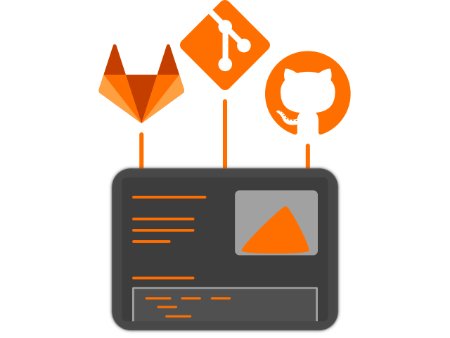
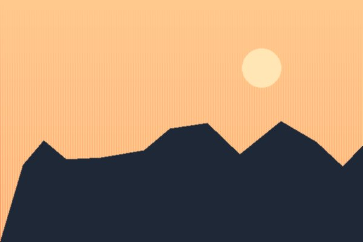

= Hardware and Software Requirements
Author Name
:idprefix:
:idseparator: -
:!example-caption:
:!table-caption:
//:page-role: -toc
:page-pagination:
:page-tags: Beta, Internal
:page-action: Get started
:page-action-url: landing.adoc
:page-action-secondary: View source
:page-action-secondary-url: https://example.org
:description: Content test page: exercises the hero, article, TOC and pagination templates against long-form AsciiDoc.
// GH-11: the fixture goes as deep as h5 (`===== `) to exercise the full
// heading scale — `toclevels` defaults to 2 (h2/h3 only, toc.hbs), which
// would otherwise hide that deeper nesting from "On this page" entirely.
// Must be `page-toclevels`, not the bare Asciidoctor attribute: Antora's
// page-composer only copies `page-*`-prefixed attributes onto
// `page.attributes` (stripping the prefix) — see @antora/page-composer's
// own build-ui-model.js. A plain `:toclevels:` is invisible to toc.hbs.
:page-toclevels: 4

[.lead]
You are looking at the content test page for the Antora default UI.

Vestibulum consectetur nec urna a luctus.
Quisque pharetra tristique arcu fringilla dapibus.
https://example.org[Curabitur,role=unresolved] ut massa aliquam, cursus enim et, accumsan lectus.
Mauris eget leo nunc, nec tempus mi? Curabitur id nisl mi, ut vulputate urna.

== Cu solet

Nominavi luptatum eos, an vim hinc philosophia intellegebat.
Lorem pertinacia `expetenda` et nec, [.underline]#wisi# illud [.line-through]#sonet# qui ea.
H~2~0.
E = mc^2^.
*Alphabet* *алфавит* _алфавит_ *_алфавит_*.
Eum an doctus <<liber-recusabo,maiestatis efficiantur>>.
Eu mea inani iriure.footnote:[Quisque porta facilisis tortor, vitae bibendum velit fringilla vitae! Lorem ipsum dolor sit amet, consectetur adipiscing elit.]

[,json]
----
{
  "name": "module-name",
  "version": "10.0.1",
  "description": "An example module to illustrate the usage of package.json",
  "author": "Author Name <author@example.com>",
  "scripts": {
    "test": "mocha",
    "lint": "eslint"
  }
}
----

.Example paragraph syntax
[,asciidoc]
----
.Optional title
[example]
This is an example paragraph.
----

.Optional title
[example]
This is an example paragraph.

.Example title
====
.Optional title
A documentation site with at least, one documentation component that has at least, one documentation module.
====

.Example title
====
A short summary can sit above supporting media, same panel either way.

====

.Example title
====
.Optional title
A table nested in a panel fills the panel's own width rather than hugging its own.

[cols="1,3,1"]
|===
|Name |Description |Values

|size
|Shape
|`"small"` \| `"medium"` \| `"large"`
|===
====

.Summary *Spoiler Alert!*
[%collapsible]
====
Details.

Loads of details.

[cols="1,3,1"]
|===
|Name |Description |Values

|size
|Shape
|`"small"` \| `"medium"` \| `"large"`
|===
====

.Result
[%collapsible]
====
Voila!
====

=== Steps

Weave.js migration Phase 2 — see `asciidoc-extensions/lib/steps.js`.

[steps]
====
.Import the Action
Start by importing the action:

[,ts]
----
import { WeaveRectangleToolAction } from "@inditextech/weave-sdk";
----

.Register the Action
Then register it on the `Weave` instance:

[,ts]
----
const instance = new Weave({
  actions: [new WeaveRectangleToolAction()],
});
----

.Trigger the action
Finally, call it from a button or any other UI element:

* *Click* on the canvas to create a rectangle with a default size.
* *Click & drag* to create a rectangle and define its size.
====

=== Card grid

Weave.js migration Phase 2 — see `asciidoc-extensions/lib/card-grid.js`.

[cards]
====
https://example.org[WeaveAction]:: The abstract class that defines the blueprint of an action in Weave.js.

https://example.org[WeaveCommentToolAction]:: Enables users to directly comment and give feedback on the stage.

https://example.org[WeaveEraserToolAction]:: Allows users to erase elements of the canvas by clicking on them.
====

=== Some Code

How about some code?

.Avatar usage
[,js]
----
import * as React from "react";
import Avatar from "@amiga-fwk-web/components-content/avatar";

render(
  

    <Avatar color={controls.color} initials="JG" onClick={() => controls.log("click small")} />
    <Avatar color={controls.color} initials="JG" onClick={() => controls.log("click medium")} size="medium" />
    <Avatar color={controls.color} initials="JG" onClick={() => controls.log("click large")} size="large" />
  
,
);
----

A source block with no language annotated at all — still gets the surface, action bar and copy button; just no syntax colour.

[source]
----
No language is set on this block, so it renders as plain text — no
`.hljs-*` scope colour, just the code surface and the copy button.
----

And one with a single line too long to fit, to check the surface scrolls horizontally instead of wrapping or breaking the article's own width.

[,js]
----
const veryLongLine = { alpha: 1, beta: 2, gamma: 3, delta: 4, epsilon: 5, zeta: 6, eta: 7, theta: 8, iota: 9, kappa: 10 }
----

[,js]
----
vfs
  .src('js/vendor/*.js', { cwd: 'src', cwdbase: true, read: false })
  .pipe(tap((file) => { // <.>
    file.contents = browserify(file.relative, { basedir: 'src', detectGlobals: false }).bundle()
  }))
  .pipe(buffer()) // <.>
  .pipe(uglify())
  .pipe(gulp.dest('build'))
----
<.> The `tap` function is used to wiretap the data in the pipe.
<.> Wrap each streaming file in a buffer so the files can be processed by uglify.
Uglify can only work with buffers, not streams.

Here's the same code with the `wrap` role added, which enables pre-wrap, if that's your speed.

[.wrap,js]
----
vfs
  .src('js/vendor/*.js', { cwd: 'src', cwdbase: true, read: false })
  .pipe(tap((file) => {
    file.contents = browserify(file.relative, { basedir: 'src', detectGlobals: false }).bundle()
  }))
  .pipe(buffer())
  .pipe(uglify())
  .pipe(gulp.dest('build'))
----

Execute these commands to validate and build your site:

 $ podman run -v $PWD:/antora:Z --rm -t antora/antora \
   version
 3.0.0
 $ podman run -v $PWD:/antora:Z --rm -it antora/antora \
   --clean \
   antora-playbook.yml

Cum dicat #putant# ne.
Est in <<inline,reque>> homero principes, meis deleniti mediocrem ad has.
Altera atomorum his ex, has cu elitr melius propriae.
Eos suscipit scaevola at.

....
pom.xml
src/
  main/
    java/
      HelloWorld.java
  test/
    java/
      HelloWorldTest.java
....

Eu mea munere vituperata constituam.

// GH-14 (A8)/GH-14 table-sizing fix showcase — three of Asciidoctor's own
// width forms side by side: the unmarked default (`.stretch`, fills the
// 150%-capped budget) on THIS table and "Library dependencies" below;
// `[width=]` (an author-chosen percentage of that same budget, no
// Asciidoctor width class at all) on "Library dependencies" (50%) and
// "Supported runtimes" (25%); `[%autowidth]` (`.fit-content` — shrinks to
// the content's own intrinsic width) on the small fixture just below this
// one.
[cols="1,1,1"]
|===
|Input | Output | Example

m|foo\nbar
l|foo
bar
a|
[,ruby]
----
puts "foo\nbar"
----
|===

.Autowidth (shrinks to content, capped at 150%/the grid column same as the others)
[%autowidth]
|===
|Status |Value
|Build |passing
|Coverage |92%
|===

Here we just have some plain text.

[source]
----
plain text
----

==== A nested subsection

Nested one level under _Some Code_ — exercises the `h4` step of the GH-11 heading
scale (`title/s`, Figma 3615:59166).

===== And one level deeper still

The `h5` step (`title/xs`) — the last one the design defines a distinct size for;
`h6` shares it.

[.rolename]
=== Liber recusabo

Select menu:File[Open Project] to open the project in your IDE.
Per ea btn:[Cancel] inimicus.
Ferri kbd:[F11] tacimates constituam sed ex, eu mea munere vituperata kbd:[Ctrl,T] constituam.

.Sidebar Title
****
Platonem complectitur mediocritatem ea eos.
Ei nonumy deseruisse ius.
Mel id omnes verear.

Altera atomorum his ex, has cu elitr melius propriae.
Eos suscipit scaevola at.
****

No sea, at invenire voluptaria mnesarchum has.
Ex nam suas nemore dignissim, vel apeirian democritum et.
At ornatus splendide sed, phaedrum omittantur usu an, vix an noster voluptatibus.

---

.Ordered list with customized numeration
[upperalpha]
. potenti donec cubilia tincidunt
. etiam pulvinar inceptos velit quisque aptent himenaeos
. lacus volutpat semper porttitor aliquet ornare primis nulla enim

Natum facilisis theophrastus an duo.
No sea, at invenire voluptaria mnesarchum has.

.Unordered list with customized marker
[square]
* ultricies sociosqu tristique integer
* lacus volutpat semper porttitor aliquet ornare primis nulla enim
* etiam pulvinar inceptos velit quisque aptent himenaeos

Eu sed antiopam gloriatur.
Ea mea agam graeci philosophia.

[circle]
* circles
** circles
*** and more circles!

At ornatus splendide sed, phaedrum omittantur usu an, vix an noster voluptatibus.

* [ ] todo
* [x] done!

Vis veri graeci legimus ad.

sed::
splendide sed

mea::
tad::
agam graeci

Let's look at that another way.

[horizontal]
sed::
splendide sed

mea::
agam graeci

At ornatus splendide sed.

.Library dependencies (width=50%)
[width=50%,stripes=hover,cols="2,>2"]
|===
|Library |Version

|eslint
|mono:[^1.7.3]

|eslint-config-gulp
|mono:[^2.0.0]

|expect
|mono:[^1.20.2]

|istanbul
|mono:[^0.4.3]

|istanbul-coveralls
|mono:[^1.0.3]

|jscs
|mono:[^2.3.5]

|===

.Configuration properties (nowrap-cols=1 — property tokens never break)
[cols="2,^1,2",nowrap-cols="1"]
|===
|Property |Default |Description

|mono:[retry.max-attempts]
|`3`
|Number of times a failed request is retried before it is reported as failed.

|mono:[retry.backoff]
|`200ms`
|Base delay between retries; doubles on each subsequent attempt.

|mono:[timeout.connect]
|`5s`
|Maximum time to wait for a connection to be established.
|===

// GH-14 (A8) fixtures — the trio above already exercises the three width
// classes, header/no-header and stripes/footer; these cover what they
// don't: `.compact`'s detail/m scale, `grid=cols` verticals, `%noheader`,
// the `mono:`/`label:` macros mixed with prose and inline code (Figma
// 2735:55589), and enough columns/content to force horizontal scroll —
// both the guaranteed case below breakpoint m and a table wide enough to
// need it even at l.

.Avatar props (default width, compact)
[.compact,cols="1,^2,^2"]
|===
|Name |Type |Default

|size
|small \| medium \| large
|medium

|type
|circle \| square
|circle

|color
|light \| dark
|light
|===

.Supported runtimes (no header row)
[%noheader,width=25%,cols="2,>2"]
|===
|Node.js |`>= 24`
|pnpm |`>= 10`
|Antora |`~3.1`
|===

.Component props
[cols="1,3,1"]
|===
|Name |Description |Values

|mono:[className]
|Additional CSS to be applied to the component
|label:[String]

|mono:[onClick]
|Function which will be called when clicking on the component. Fires after `pointerup`.
|label:[Function]

|mono:[size]
|Shape
|label:[small] label:[medium] label:[large]

|mono:[status]
|Read-only once mounted.
|label:red[deprecated] label:green[stable] label:blue[beta]
|===

.Wide reference table (forces horizontal scroll below breakpoint m; nowrap-cols=all)
[cols="7*",nowrap-cols="1,2,3,4,5,6,7"]
|===
|Region |Zone |Instance |vCPU |Memory |Storage |Network

|eu-west
|1a
a|m6i.large +
with some large text to test this 
|2
|8 GiB
|EBS
|Up to 10 Gbps
|eu-west |1b |m6i.xlarge |4 |16 GiB |EBS |Up to 10 Gbps
|us-east |1a |m6i.2xlarge |8 |32 GiB |EBS |Up to 12.5 Gbps
|===

.Super-wide reference table (11 columns — needs its own scroll even at breakpoint l, past the 150% cap)
[table-width=2000px,cols="11*",nowrap-cols="1,2,3,4,5,6,7,8,9,10,11"]
|===
|Region |Zone |Instance |vCPU |Memory |Storage |Network |IOPS |Bandwidth |Price/hr |SLA

|eu-west-1 |1a |m6i.2xlarge |8 |32 GiB |EBS gp3 |Up to 12.5 Gbps |6000 |250 MB/s |mono:[$0.4032] |99.99%
|eu-west-1 |1b |m6i.4xlarge |16 |64 GiB |EBS gp3 |Up to 12.5 Gbps |9000 |400 MB/s |mono:[$0.8064] |99.99%
|us-east-1 |1a |m6i.8xlarge |32 |128 GiB |EBS gp3 |12.5 Gbps |12000 |750 MB/s |mono:[$1.6128] |99.95%
|===

Cum dicat putant ne.
Est in reque homero principes, meis deleniti mediocrem ad has.
Altera atomorum his ex, has cu elitr melius propriae.
Eos suscipit scaevola at.

[TIP]
This oughta do it!

Cum dicat putant ne.
Est in reque homero principes, meis deleniti mediocrem ad has.
Altera atomorum his ex, has cu elitr melius propriae.
Eos suscipit scaevola at.

[NOTE]
====
You've been down _this_ road before.
====

Cum dicat putant ne.
Est in reque homero principes, meis deleniti mediocrem ad has.
Altera atomorum his ex, has cu elitr melius propriae.
Eos suscipit scaevola at.

[WARNING]
====
Watch out!
====

[CAUTION]
====
[#inline]#I wouldn't try that if I were you.#
====

[IMPORTANT]
====
Don't forget this step!
====

.Key Points to Remember
[TIP]
====
If you installed the CLI and the default site generator globally, you can upgrade both of them with the same command.

 $ npm i -g @antora/cli @antora/site-generator

Or you can install the metapackage to upgrade both packages at once.

[subs=+quotes]
 $ npm i -g *antora*
====

Nominavi luptatum eos, an vim hinc philosophia intellegebat.
Eu mea inani iriure.

[discrete]
== Voluptua singulis

[discrete]
=== Nominavi luptatum

Cum dicat putant ne.
Est in reque homero principes, meis deleniti mediocrem ad has.
Ex nam suas nemore dignissim, vel apeirian democritum et.

.Antora is a multi-repo documentation site generator

.A raster photo narrower than the text measure — renders at its own real size, no cropping

.A raster photo wider than the text measure but inside the +25% cap — still its own real size
image::photo-medium.png[A medium photo]

.A raster photo well past the +25% cap — clamped down to the budget

.A raster photo fixed to 400px wide, no matter what the text measure is and aligned to the left

.Naturally with Jake Blauvelt
video::fUvDykQUgMk[youtube,align=left]

[#english+中文]
== English + 中文

Altera atomorum his ex, has cu elitr melius propriae.
Eos suscipit scaevola at.

[,'Famous Person. Cum dicat putant ne.','Cum dicat putant ne. https://example.com[Famous Person Website]']
____
Lorem ipsum dolor sit amet, consectetur adipiscing elit.
Mauris eget leo nunc, nec tempus mi? Curabitur id nisl mi, ut vulputate urna.
Quisque porta facilisis tortor, vitae bibendum velit fringilla vitae!
Lorem ipsum dolor sit amet, consectetur adipiscing elit.
Mauris eget leo nunc, nec tempus mi? Curabitur id nisl mi, ut vulputate urna.
Quisque porta facilisis tortor, vitae bibendum velit fringilla vitae!
____

Lorem ipsum dolor sit amet, consectetur adipiscing elit.

[verse]
____
The fog comes
on little cat feet.
____

== Fin

That's all, folks!
