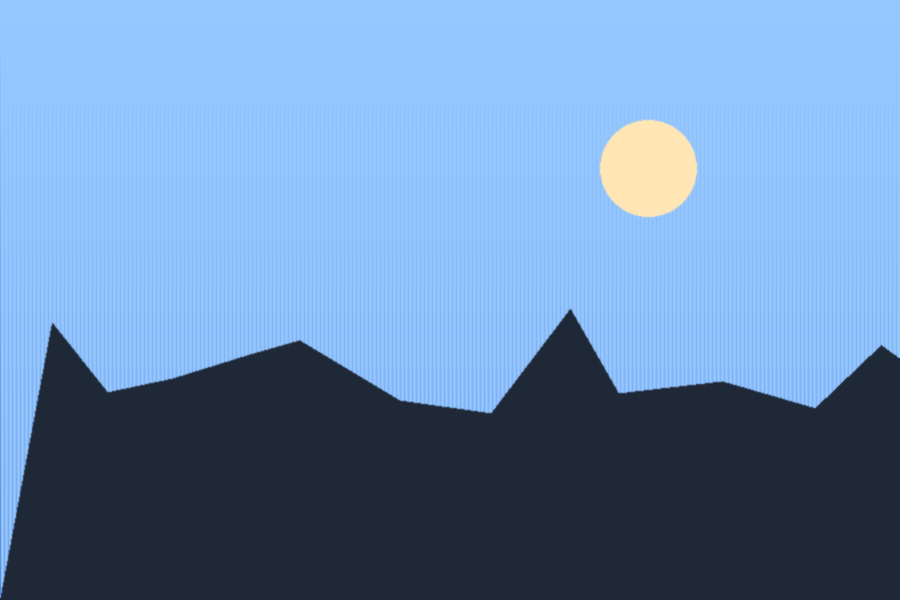

= ATD Framework
:page-layout: home
:page-nav-module: sdk
:description: Landing view test page (GH-18) — the home layout's shell: header toolbar in its Home state, side menu, hero column slot, content blocks and the site footer.
:page-tags: efficiency, speed, support
:page-action: Go to tool
:page-action-url: https://github.com/InditexTech/atd-docs
:page-action-secondary: Quickstart
:page-action-secondary-url: content.adoc
:page-hero-image: /photo-medium.png
:page-hero-image-alt: Placeholder still standing in for the product screenshot the design frames.

The landing's content column starts with a preamble: everything above the first
`==` heading. The design uses it for a short lead-in, and it is the one block on
the page with no heading row of its own.

The hero column beside it is authored on this page (GH-19): the product mark
comes from `site.keys.productLogo`, the name from this document's own title,
and the chips, actions and media slot from the `:page-*:` attributes above.
The two actions cover both branches of the external-link rule — the primary
points off-site and gets the `link-external` icon, the secondary resolves to a
page here and does not. At `m` and `l` the column sticks while this one scrolls
past it; at `s` and `xs` the two stack, and the product name steps down from
`display/l` to `display/m`.

Swap `:page-hero-image:` for `:page-hero-video:` (with an optional
`:page-hero-video-poster:`) to preview the video branch of the media slot,
which renders a native `<video controls>` rather than a still.

The side menu shows the SDK module's navigation, not this page's own: the
landing lives in `ROOT`, which has no navigation of its own, and
`:page-nav-module: sdk` is what borrows another module's. The switcher reads
"SDK" for the same reason.

== Quicklinks

[cards,type=image-square,columns="1 s:2 m:4",width=container]
====
[card,subheader="Long form"]
.link:content.html[Content test page]
--

The long-form doc kitchen sink, rendered through the `default` layout.
--

[card,subheader="Chrome"]
.link:landing.html[Landing test page]
--

Site chrome around a normal doc page, hero opted out.
--

[card,subheader="Single-column"]
.link:home-single.html[Single-column landing test page]
--

The `home-single` layout: same hero, stacked above the content column
instead of beside it.
--

[card,subheader="Assets"]
.link:icons.html[Icons catalog]
--

Every icon in the vendored sprite.
--

[card,subheader="Edge case"]
.link:404.html[404 page]
--

The not-found page.
--
====

== Supported features

Blocks on this page come from Asciidoctor extensions rather than from the
layout, so a landing stays authored content. The Quicklinks row above is the
first of them (GH-20, the `[cards]` block); until GH-21 lands any AsciiDoc
renders here, which is what this section is for: it checks that the block's
heading row, its dashed rule and the gaps around its body are right
regardless of what fills it.

* A plain list, to check body rhythm inside a block.
* A second item.
* A third.

== Free & open source

The `[cta]` block (GH-23) is its own section, like every other landing
block, rather than trailing content of the one above it — the same
dashed-rule heading band every `==` here gets, home.css's own rule, not a
second title inside the block. Styled after Fumadocs' "Free & Open Source"
block on the Weave.js docs home rather than a Figma frame (this block has
none). A flat `--ids-color-bg-low` band rather than an inverse one: see
cta.js and cta.css for why. The mark reuses the site's own product logo
pair, one image per theme, exactly as the hero does.

[cta]
====

ATD Framework is actively maintained and open for contributions. It comes
with best-in-class documentation and developer experience.

[.primary]
https://github.com/InditexTech/atd-docs[Create a fork]
====

== Key features

The `[feature-tabs]` block (GH-22) — the landing's one interactive block, and
the one to check with JavaScript disabled: every slide should render in
sequence under its own heading, with the labels above them as working in-page
anchors. With script on it is a vertical tablist: click a label, or focus one
and arrow through them.

The four slides below cover every branch the block has. The first carries an
explicit `label=` beside its heading, so the tabs say the short thing and the
panel the long one; the middle two have a heading only, so their heading and
their label are the same words and the heading is hidden once the tabs exist;
the last has a label only and no heading at all, which is what the frames draw.
The first two have a call to action — one leaving the site, which derives the
external-link icon, one staying in it, which does not; the last two have none.

[feature-tabs]
====
[feature,label="UI-agnostic"]
.Integrates with the UI framework of your choice
--

A slide is a media still, this prose, and an optional call to action, in that
order however they were authored. The still is fluid at every breakpoint and
letterboxed on `--ids-color-bg-low` rather than cropped, since these are
diagrams as often as photographs.

[.cta]
https://github.com/InditexTech/atd-docs[Know more]
--

[feature]
.Powerful abstractions
--

This slide's label and heading say the same thing, which is what the design's
own copy does — so with the tabs running, the heading is hidden from the eye
and kept for assistive technology, and with them off it is an ordinary visible
heading.

[.cta]
link:content.html[Read the long form]
--

[feature]
.Optimized for real-time
--

No call to action on this slide: it is optional, and a slide without one should
end at its prose rather than at an empty row.
--

[feature,label="Format and style for your code"]
--

The fourth slide has no `.Title` at all — a heading is optional, and this is
what the design's own slides look like: media, prose, nothing above them. It
also checks that the label column wraps a long label to two lines inside its
254px without disturbing the 12px rhythm between labels.
--
====

== Get started

The final block sits 80 above the site footer at every breakpoint. The footer
itself is the landing's own — four columns, dashed rule above, no
previous/next and no feedback row, since a landing is not a page in a reading
sequence.
